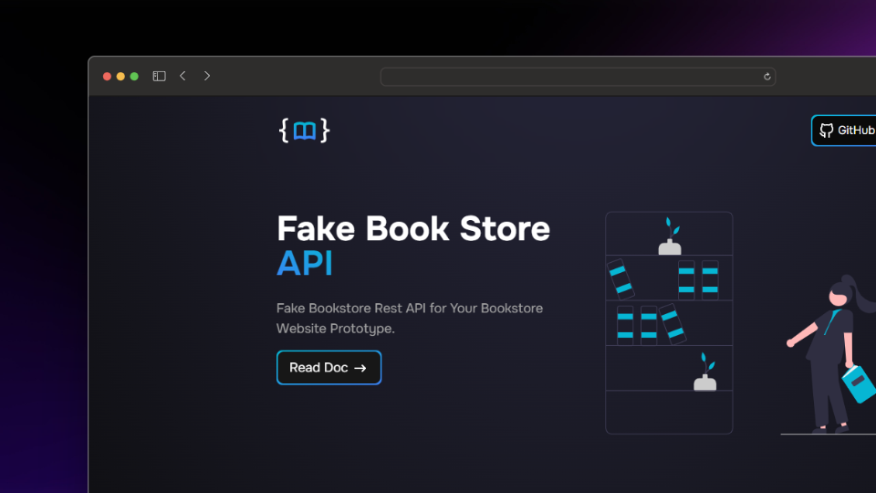

# Fake Book Store Documentation

Fake Books API is a free online REST API that you can use whenever you need pseudo-real data for your library application, whether for development, testing, or educational purposes. This API provides dummy information about books, authors, and categories with authentication.

## 🧞 Commands

All commands are run from the root of the project, from a terminal:

| Command                   | Action                                           |
| :------------------------ | :----------------------------------------------- |
| `npm install`             | Installs dependencies                            |
| `npm run dev`             | Starts local dev server at `localhost:4321`      |
| `npm run build`           | Build your production site to `./dist/`          |
| `npm run preview`         | Preview your build locally, before deploying     |
| `npm run astro ...`       | Run CLI commands like `astro add`, `astro check` |
| `npm run astro -- --help` | Get help using the Astro CLI                     |

## Copyright??

The images in the books were obtained from the Internet and are used without claim of ownership and belong to their respective owners. :slightly_smiling_face:

These images and author names are used solely for educational purposes, without any profit interest. :innocent:

You can find their respective books in online stores if you are interested in any of them.

## Some of my platforms... :innocent:

- [GitHub](https://github.com/FLCHRIS) :black_heart:
- [Website](https://fkhris-ts.netlify.app/) :face_in_clouds:

**HAPPY CODING!!** :upside_down_face: :v: